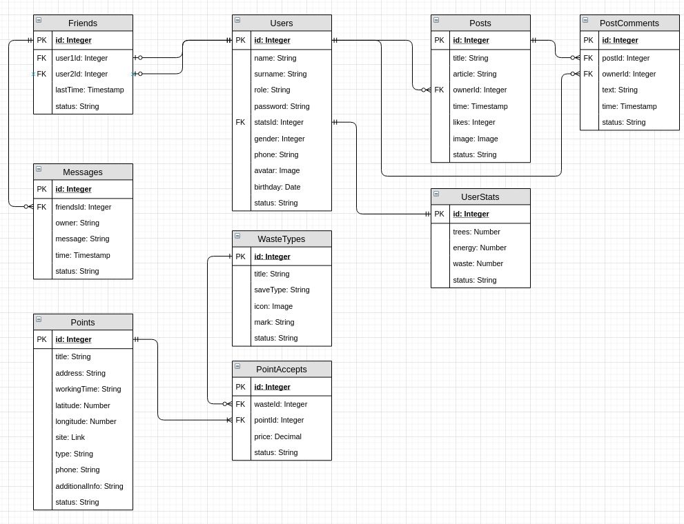

# Database 🗃️

This document describes a database scheme and constraints.

## Tables

- [Users](./01_Tables/01_Users.md)
- [User Statistics](./01_Tables/02_UserStats.md)
- [Friends](./01_Tables/03_Friends.md)
- [Messages](./01_Tables/04_Messages.md)
- [Posts](./01_Tables/05_Posts.md)
- [Post Comments](./01_Tables/06_PostComments.md)
- [Points](./01_Tables/07_Points.md)
- [Waste Types](./01_Tables/08_WasteTypes.md)
- [Point Accepts](./01_Tables/09_PointAccepts.md)

## Views

- [User with stats](./02_Views/01_user_with_stats.md)
- [Relationships](./02_Views/02_relationships.md)
- [Post owners](./02_Views/03_post_owners.md)
- [Comments owners](./02_Views/04_comments_owner.md)
- [Point accepting list](./02_Views/05_point_accepting_list.md)
